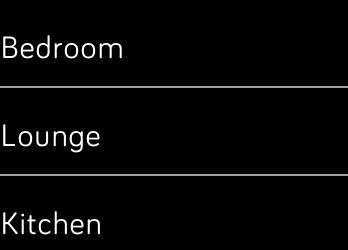

   

# sonos-ionic
An app for the FitBit Ionic to control your Sonos system

# Screenshots

# Thanks

The typescript definitions for the fitbit apis are taken from https://github.com/vaskevich/fitbit-typescript-starter.
